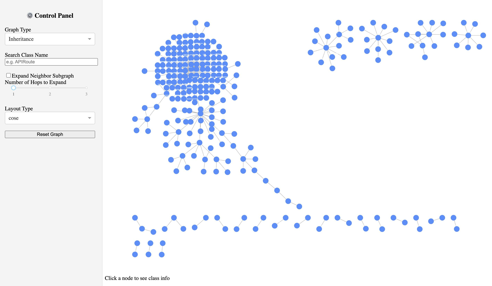

# Python Class Graph Analyzer

This repository bundles two tools that work together:

- `analyze.py` walks a Python codebase, inspects class definitions, attributes, and method bodies with `ast`, and serializes inheritance plus call information into JSON.
- `app/app.py` is a Dash + Cytoscape UI that loads that JSON so you can explore inheritance hierarchies, class dependencies, and method-level call graphs interactively.

The sample data under `data/` was produced from real projects, but you can point the analyzer at any Python source tree you control.

## Features

- **Static analyzer** – walks ASTs to capture inheritance, attributes, method definitions, and call targets without importing or executing project code.
- **Multiple graph views** – produces inheritance hierarchies, “class uses class” dependency graphs, and method-level call graphs from the same dataset.
- **Interactive dashboard** – Dash + Cytoscape UI with search, hop-based neighbor expansion, reset, and layout selection so you can explore large graphs quickly.
- **Pluggable data source** – point `analyze.py` at any Python repo and feed the resulting JSON straight into the app or other tooling.

## Requirements

- Python 3.9+ (the analyzer uses `ast.unparse`, added in 3.9).
- Packages listed in `requirements.txt` (install with `pip install -r requirements.txt`).

## Quick Start

```bash
pip install -r requirements.txt
```

### 1. Prepare a Python project

```bash
git clone https://github.com/fastapi/fastapi
```
    
### 2. Analyze a project

```bash
# python analyze.py <path/to/python/project> <optional_output_name>

python analyze.py ./fastapi fastapi_analysis_results
```

- The script walks the directory, parses every `.py` file, and writes a JSON file next to the target project.
- If you omit the output filename, it defaults to `<project>_analysis_results.json`.

### 3. Launch the Dash explorer

```bash
# python app/app.py --data </path/to/<project>_analysis_results.json>

python app/app.py --data ./fastapi_analysis_results.json
```

- Use the controls on the left to switch between inheritance, call graph, class dependency, or class-method-call views.
- Search for classes, click nodes to inspect their metadata, and expand neighbor subgraphs up to three hops.
- The Cytoscape layout can be changed dynamically (cose, breadthfirst, circle, grid, random).

## UI



